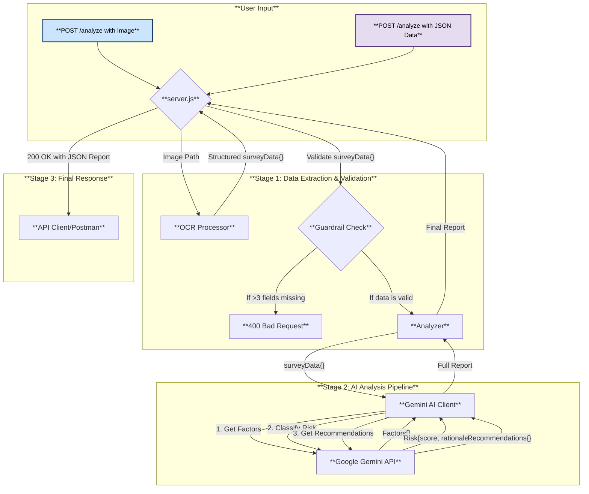

AI-Powered Health Risk Profiler
====================================
1.Overview
--------------------------
This project is a sophisticated backend service designed to analyze lifestyle survey responses and generate a comprehensive health risk profile. It leverages a powerful pipeline that accepts either image-based surveys (via OCR) or direct JSON text/object input, processes the data through Google's Gemini AI for multi-step analysis, and returns a structured JSON report.

The core functionalities include data extraction from images, a data quality guardrail, risk factor identification, risk classification with a numerical score, and the generation of personalized, actionable recommendations. The entire service is exposed as a REST API built with Node.js and Express, making it easy to integrate with any frontend application or testing tool.

2.Project Architecture & Flow
 -----------------------------------
The application is built on a modular architecture that separates concerns for clarity and maintainability. The following diagrams illustrate the project's data flow and code structure.

Project Flow (Mind Map)
This mind map shows the complete data flow from the initial user request to the final AI-generated report.

Code Structure (Mind Map)
-------------------------------------------
This diagram shows how the different JavaScript files in the project are organized and how they import modules from each other.

3.Setup and Installation
----------------------------------------
Prerequisites
Node.js (v16+ recommended)
```
NPM (included with Node.js)
```
A Google Gemini API Key

Step-by-Step Setup
Clone the Repository:
```
git clone <https://github.com/ubed2004/Factor_risking.git>
cd Factor_risking
```

Install Dependencies:
Run this command to install all necessary libraries from package.json:
```
npm install
```
Configure Environment Variables:

In the root of the project, create a new file named .env.

Obtain an API key from Google AI Studio.

Add the key to your .env file:
```
GOOGLE_API_KEY=AIzaSy...your_personal_api_key_here
```
4.How to Run the Application
------------
To start the API server, run the following command from the project's root directory:
```
 node server.js
```
The server will start and listen for requests on 
```
http://localhost:3000.
```
 5.API Reference
------------------
This section provides a detailed reference for using the API.

Endpoint: POST /analyze
This single endpoint processes all survey data.

Option A: Analyze an Image
Use this method to send an image file for OCR and analysis.
```
Method: POST

URL: http://localhost:3000/analyze

Body: form-data

Key: surveyImage

Type: File

Value: Select your survey image file.
```
Example curl command:
```
curl -X POST -F "surveyImage=@ocr_processing/sample_image.png" http://localhost:3000/analyze
```
Option B: Analyze Raw JSON Data
Use this method to send survey data directly as a JSON object, bypassing the OCR step.
```
Method: POST

URL: http://localhost:3000/analyze

Headers: Content-Type: application/json
```
```
Body: raw (JSON)

{
  "age": 58,
  "smoker": false,
  "exercise": "I walk for 30 minutes most mornings",
  "diet": "My diet is balanced but I have a sweet tooth",
  "alcohol": "A glass of wine a couple times a week",
  "sleep": "I usually get about 6 hours of sleep"
}
```
Example curl command:
```
curl -X POST -H "Content-Type: application/json" -d '{"age": 58, "smoker": false, "exercise": "I walk daily"}' http://localhost:3000/analyze
```
Success Response (200 OK)
----------------------
A successful analysis returns a JSON object with the full report.
```
Example Body:

{
    "analyzedData": {
        "age": 42,
        "smoker": true,
        "exercise": "rarely"
    },
    "identifiedFactors": [
        "Smoking",
        "Lack of physical activity"
    ],
    "factorsOfrisk": {
        "risk_level": "high",
        "score": 75,
        "rationale": [
            "Smoking",
            "Lack of physical activity"
        ]
    },
    "personalizedRecommendations": {
        "risk_level": "high",
        "factors": [
            "Smoking",
            "Lack of physical activity"
        ],
        "recommendations": [
            "Consider setting a quit date to begin your journey to better health.",
            "Try to incorporate at least 15-20 minutes of walking into your daily routine."
        ],
        "status": "ok"
    }
}
```
Error Response (400 Bad Request)
------------------
If more than 3 fields are missing or empty in the input, the server will respond with an error.
```
Example Body:

{
    "error": "OCR text is missing multiple expected fields.",
    "missingFields": [
        "smoker",
        "exercise",
        "diet",
        "sleep"
    ]
}

```
6.AI Prompt
------------------
The core of the analysis is controlled by the system prompts sent to the Google Gemini API.

Prompt 1: Get Risk Factors
Used to summarize the user's input into professional phrases.
```
"You are a health data summarizer. For each lifestyle habit provided, identify the key factor and describe it in a clear, professional phrase (e.g., 'High sugar intake', 'Lack of physical activity'). You must summarize every category provided. Your response MUST be a single, valid JSON object with a single key, 'risk_factors', which is a list of these summary strings."
```
Prompt 2: Risk Classification
Used to generate a score and risk level.
```
"You are a health risk classification engine. Your task is to analyze a list of lifestyle factors. Based on these factors, you must calculate a numerical score between 0 and 95, determine an overall risk_level ('low', 'medium', 'high'), and provide a rationale (a list of the primary factors). Your response MUST be a single, valid JSON object with the keys risk_level, score, and rationale."
```
Prompt 3: Get Recommendations
Used to generate the final report and advice.
```
"You are an expert health analyst. Your task is to analyze a user's survey responses. Based on the data, you must determine an overall risk_level, list the key factors, provide a simple recommendation for each factor, and set a status field to 'ok'. Your response MUST be a single, valid JSON object with the keys risk_level, factors, recommendations, and status."
```
7.Project Structure (File Tree)
-----------------   
 ```
/Factor_risking/
├── server.js
         # Main Express server file with API routes.
├── package.json            # Project dependencies and scripts.
├── .env                    # Stores the secret Google Gemini API key.
├── .gitignore              # Tells Git to ignore files/folders.
|
├── /analysis/
│   └── analyzer.js         # Bridge that calls the AI client functions.
|
├── /clients/
│   └── geminiClient.js     # Handles all communication with the Gemini API.
|
└── /ocr_processing/
    ├── processor.js        # Handles OCR logic using Tesseract.
    └── sample_image.png    # Example image for testing.

    ```
 
